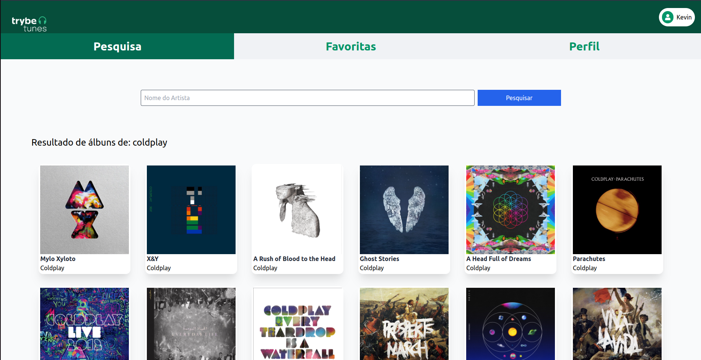

# Projeto trybetunes

# Contexto
Este projeto trata-se de um site de pesquisa de álbuns e músicas do itunes, desenvolvido enquanto estudava na [Trybe](https://www.betrybe.com/).
<br>
O projeto me desafiou a aprender react Routes e o ciclo de vida dos componentes em react. Além de lidar com uma api externa, que traz previews de músicas e outras informações. O site tem design responsivo usando tailwind.

<br>
⚠️ Pasta service com funções de armazenamento em localStorage disponiblizado pela trybe, já que o projeto era apenas Front-end e não abordava banco de dados.

## Páginas
* /search<br>
Página de Login de usuário
* /search<br>
Onde é possível pesquisar álbuns por autor
* /album/:id<br>
Mostra todas as músicas do álbum selecionado
* /favorites<br>
Acessa as músicas favoritas salvas em LocalStorage
* /profile<br>
Mostra perfil do usuário
* /profile/edit<br>
Forms simples para edição de perfil

## Técnologias usadas

Front-end:
> Desenvolvido usando: React, CSS3, HTML5, ES6 e tailwind

## Instalando Dependências
```
npm install
``` 
## Executando aplicação via docker

```
npm start
```